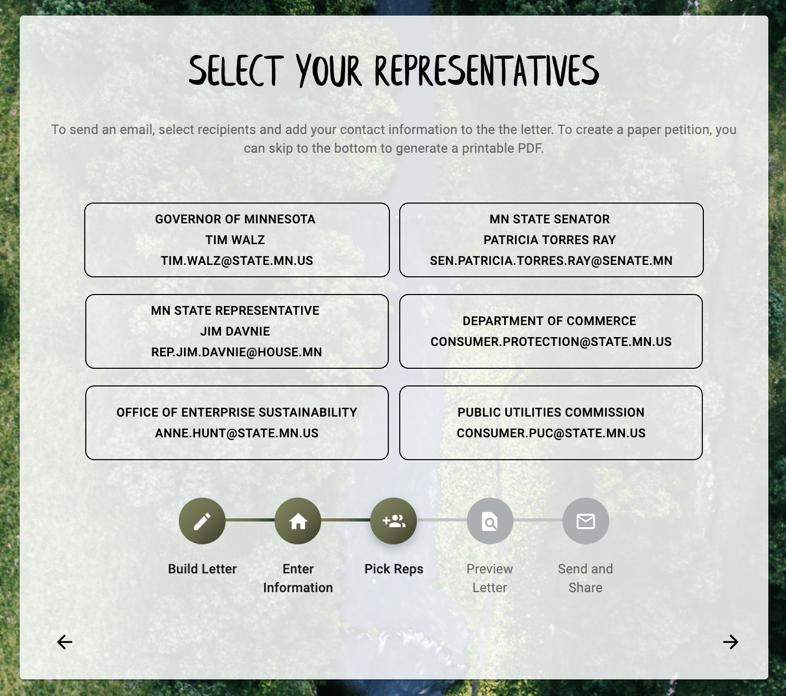
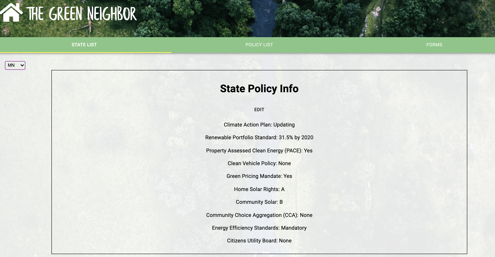

# Green Neighbor Letter Builder

Full stack web app built for the Green Neighbor Challenge. This app helps users learn about energy policies in their state, and contact their elected officials to advocate for green policies. Users can view educational info about major policies, see how their state ranks, and then begin the letter builder. The letter builder helps them pick the issues they care about, customize the letter text, identify their reps, and send the letter!

On the admin side, Green Neighbor staff can edit and update all of the data that fills the letter builder, including petition text, policy info, and state by state data. 

## Built With

Javascript, React, Node.js, Express.js, Google Geocoding API, Google Civic API, PostgreSQL, Material-UI, HTML5, CSS, Passport

## Getting Started

These instructions will get you a copy of the project up and running on your local machine for development and testing purposes. 

## Screenshots

### Prerequisites

- [Node.js](https://nodejs.org/en/)
- [Postico](https://eggerapps.at/postico/)

### Installing

- NPM install.

- Copy and paste entry in database.sql file in home directory to create necessary tables in Postico.

### Completed Features

- [x] Find state by zip code
- [x] View summary and long info about green policies
- [x] Create letter, including adding policy text blocks and editing intro/conclusion text
- [x] Find elected reps by Address
- [x] Share to social media
- [x] Admin - edit policy text and state data
- [x] Admin - add/delete states, policies, state offices

### Next Steps

- [x] Integration with MailChimp for newsletter sign up
- [x]  Print letter as PDF

## Authors

[Jenni Schubert](https://github.com/jjschubert) , [Riley Webster](https://github.com/rileyww77/), [Patrick Mazurek](https://github.com/jpmzurk), [Paul Buysse](https://github.com/paulbuysse)
