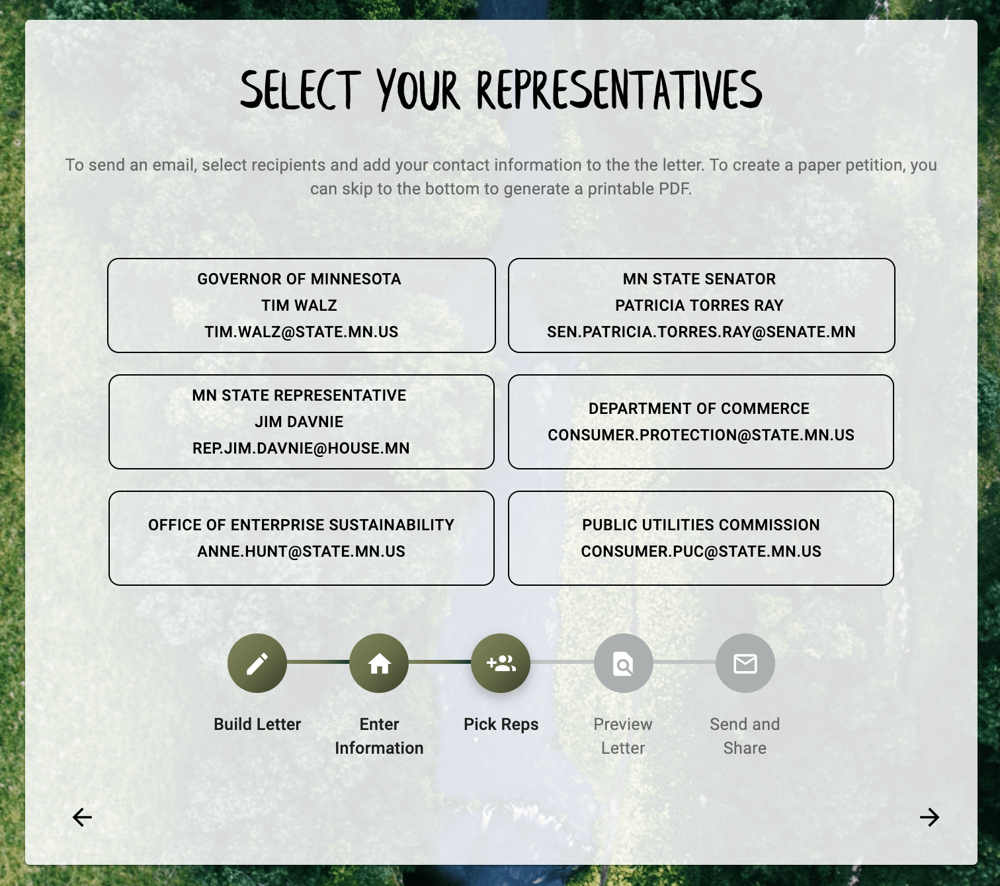

# Green Neighbor Letter Builder

Full stack web app built for the Green Neighbor Challenge. This app helps users learn about energy policies in their state, and contact their elected officials to advocate for green policies. Users can view educational info about major policies, see how their state ranks, and then begin the letter builder. The letter builder helps them pick the issues they care about, customize the letter text, identify their reps, and send the letter!

On the admin side, Green Neighbor staff can edit and update all of the data that fills the letter builder, including petition text, policy info, and state by state data. 

## Screenshots





## Getting Started

These instructions will get you a copy of the project up and running on your local machine for development and testing purposes. 

### Prerequisites

- [Node.js](https://nodejs.org/en/)

### Installing

1. Create a database named 'greenNeighbor'.
2. The queries in the database.sql file are set up to create all the necessary tables and populate the needed data to allow the application to run correctly. The project is built on [Postgres](https://www.postgresql.org/download/), so you will need to make sure to have that installed. We recommend using Postico to run those queries as that was used to create the queries, 
3. There is also a file for each table that contains insert statements to get the core data entered for the app to run. 
4. Open up your editor of choice and run an `npm install`
5. Run `npm run server` in your terminal
6. Run `npm run client` in your terminal
7. The `npm run client` command will open up a new browser tab for you!

### Creating the .ENV
* Create a `.env` file at the root of your project. This file will require several pieces of information that will each need to acquired separately. Further instructions on obtaining these keys are provided below:
     ```
    SERVER_SESSION_SECRET = ***********
    zip_key = ********************
    API_KEY = ********************
    ```
First you will need to establish a **SERVER_SESSION_SECRET** to keep your application secure. Here's a site that can help you generate a secret: [https://passwordsgenerator.net/](https://passwordsgenerator.net/).  **NOTE** This secret should be more than 8 characters.  Having a secret key that is less than 8 characters will result in a warning from the app.

#### Google Geocoding API
This app uses the Google Geocoding API to convert zip codes to state information. To use this API, you must create a developer account, provide billing information, and enable the Geocoding API. You can reference [instructions and docs from Google](https://developers.google.com/maps/documentation/geocoding/start) for additional guidance on how to do this.

Make sure to record the key you receive. Save this in your .env file set to zip_key. 

#### Google Civic API
We used the Google Civic API to find state representatives from the user's address. Once you've set up the geocoding api, you can enable that key to also work for the civic api by logging into the [Google Developer Console](https://console.developers.google.com/) and clicking "enable APIs and Services". 

## Built With

Javascript, React, Node.js, Express.js, Google Geocoding API, Google Civic API, PostgreSQL, Material-UI, HTML5, CSS, Passport, react-custom-share, Font Awesome, @react-pdf/renderer

### Completed Features

- [x] Find state by zip code
- [x] View summary and long info about green policies
- [x] Create letter, including adding policy text blocks and editing intro/conclusion text
- [x] Find elected reps by Address
- [x] Share to social media
- [x] Admin - edit policy text and state data
- [x] Admin - add/delete states, policies, state offices
- [x]  Print letter as PDF

### Next Steps

- [ ] Integration with MailChimp for newsletter sign up


## Authors

[Jenni Schubert](https://github.com/jjschubert) , [Riley Webster](https://github.com/rileyww77/), [Patrick Mazurek](https://github.com/jpmzurk), [Paul Buysse](https://github.com/paulbuysse)
